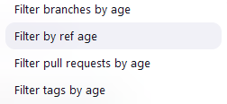
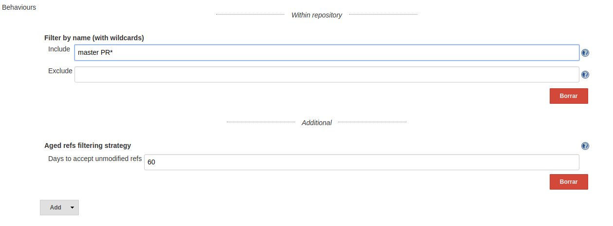
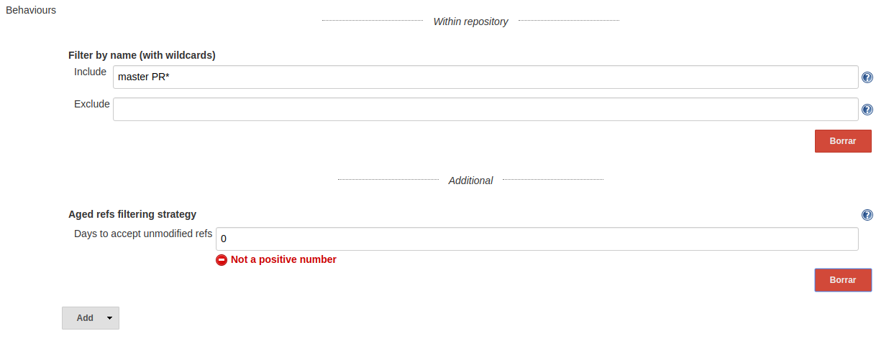

# Branch source Aged Refs

This is a collection of extensions for several branch source Jenkins plugins.

It provides filters for

- [Bitbucket]: 
  Filtering references (branches, tags and pull requests)
- [GitHub]: 
  Filtering references (branches, tags and pull requests)

This filter will ignore references (branches, tags and/or pull requests) where its last
commit creation date is older than the defined threshold (in days). Ignored
references won't be added as sources or will be disabled and tagged for
deletion on the next full repository scan.

[Bitbucket]: https://plugins.jenkins.io/cloudbees-bitbucket-branch-source/

[GitHub]: https://plugins.jenkins.io/github-branch-source/

## Usage

There are four different behaviours available:

- **Filter by ref age**: Applies the days filter to branches, tags and pull requests.
- **Filter branches by age**: Applies the days filter only to branches.
- **Filter pull requests by age**: Applies the days filter only to pull requests.
- **Filter tags by age**: Applies the days filter only to tags.

When defining a new job (or Organization folder), include any of the behaviours. They are placed under the additional
separator.

All behaviour are configurable, being mandatory to specify the
acceptable threshold (positive days) for each reference:

In case of an invalid positive threshold, the form won't validate:

