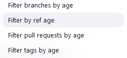
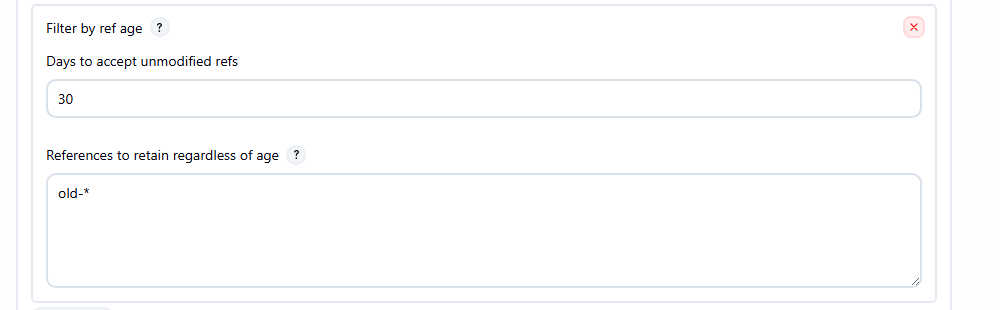
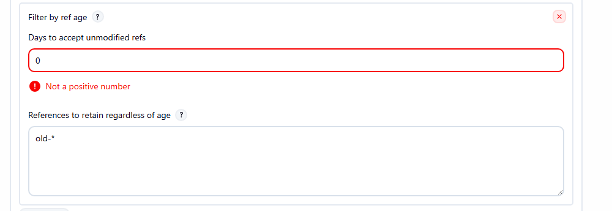

# Branch source Aged Refs

[](https://github.com/jenkinsci/scm-filter-aged-refs-plugin/releases/latest)
[](https://ci.jenkins.io/job/Plugins/job/scm-filter-aged-refs-plugin/job/main/)
[](https://github.com/jenkinsci/scm-filter-aged-refs-plugin/blob/main/LICENSE)


This is a collection of extensions for several branch source Jenkins plugins.

It provides filters for

- [Bitbucket]: 
  Filtering references (branches, tags and pull requests)
- [GitHub]: 
  Filtering references (branches, tags and pull requests)

This filter will ignore references (branches, tags and/or pull requests) where its last
commit creation date is older than the defined threshold (in days). Ignored
references won't be added as sources or will be disabled and tagged for
deletion on the next full repository scan.

[Bitbucket]: https://plugins.jenkins.io/cloudbees-bitbucket-branch-source/

[GitHub]: https://plugins.jenkins.io/github-branch-source/

## Usage

There are four different behaviours available:

- **Filter by ref age**: Applies the days filter to branches, tags and pull requests.
- **Filter branches by age**: Applies the days filter only to branches.
- **Filter pull requests by age**: Applies the days filter only to pull requests.
- **Filter tags by age**: Applies the days filter only to tags.



When defining a new job (or Organization folder), include any of the behaviours. They are placed under the additional
separator.

All behaviours require an acceptable age threshold, expressed as a positive number of days. They also provide an
optional list of reference-name patterns to retain regardless of age:



The form does not validate a zero or negative threshold:



### Retaining selected references regardless of age

Every filter behaviour can retain selected references even when their last commit is older than the configured
threshold. Enter reference-name glob patterns in **References to retain regardless of age**, with one pattern per line:

```text
main
release/*
v1.*
PR-123
```

Patterns are case-sensitive and are matched against the complete SCM head name. `*` matches zero or more characters,
including `/`, and `?` matches one character. Blank lines and surrounding whitespace are ignored. A reference is
retained when any pattern matches.

For branch and tag filters, patterns match the branch or tag name. Pull requests match their Jenkins SCM head name, such
as `PR-123`, rather than their source branch. **Filter by ref age** applies one pattern list to branches, tags, and pull
requests. A type-specific filter applies the list only to that reference type.

The repository's default branch is not retained automatically; add its name explicitly if it must be kept. Leaving the
field empty preserves the behaviour of earlier plugin versions. Retaining a reference means that this plugin does not
exclude it. Other SCM traits and discovery rules can still exclude the reference.

### Declarative configuration with Job DSL

The retention threshold and retained reference patterns can be configured with Job DSL. For example, inside a
Bitbucket branch source's `traits` block:

```groovy
traits {
  bitbucketAgedRefsTrait {
    retentionDays('30')
    retainedRefPatterns('''main
release/*
v1.*
PR-123''')
  }
}
```

The same property is available on each type-specific trait:

```groovy
traits {
  bitbucketAgedBranchesTrait {
    retentionDays('30')
    retainedRefPatterns('main\nrelease/*')
  }
  bitbucketAgedPullRequestsTrait {
    retentionDays('30')
    retainedRefPatterns('PR-123\nPR-456')
  }
  bitbucketAgedTagsTrait {
    retentionDays('30')
    retainedRefPatterns('v1.*')
  }
}
```

GitHub uses the corresponding `gitHubAgedRefsTrait`, `gitHubAgedBranchesTrait`, `gitHubAgedPullRequestsTrait`, and
`gitHubAgedTagsTrait` blocks.

Job DSL scripts can themselves be loaded through Jenkins Configuration as Code, keeping multibranch and organization
folder configuration reproducible across controller restarts. For example:

```yaml
jobs:
  - file: /usr/share/jenkins/ref/jobs.groovy
```
