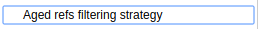

# Branch source Aged Refs

This is a collection of extensions for several branch source Jenkins plugins.

It provides filters for

- [Bitbucket]:  Filtering references (branches, tags and pull requests)
- [GitHub]:  Filtering references (branches, tags and pull requests)

This filter will ignore references (branches, pull requests and/or tags) where its last
commit creation date is older than the defined threshold (in days). Ignored
references won't be added as sources or will be disabled and tagged for
deletion on the next full repository scan.

[Bitbucket]: https://plugins.jenkins.io/cloudbees-bitbucket-branch-source/
[GitHub]: https://plugins.jenkins.io/github-branch-source/

## Usage

When defining a new job (or Organization folder), include an additional
behaviour (placed under the additional separator). 

This behaviour is configurable, being mandatory to specify the
acceptable threshold (positive days) for each reference.
It can be configured to exclude a reference type from this filter, for example, excluding the branches so the acceptable threshold is only applied to pull requests and tags.

In case of an invalid positive threshold, the form won't validate:

